# Jarvis Dashboard

A self-hosted homelab dashboard that combines infrastructure monitoring, container management, media discovery, and automated downloads into a single interface.

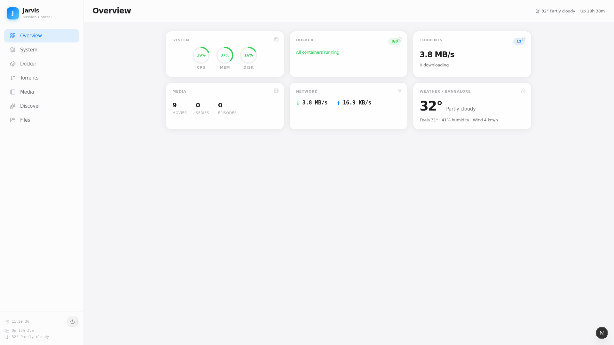

---

## Features

### Media Discovery & Downloads

Jarvis integrates a recommendation engine directly into the dashboard. Browse by mood, search by title, get personalized suggestions from your Jellyfin library, or explore what's trending — then download anything with one click through the built-in torrent client.

**Discover** — Four modes to find content:

| Mode | Description |
|------|-------------|
| **By Mood** | 12 mood categories powered by curated community data and TMDB |
| **Similar To** | Title search with autocomplete, returns TMDB recommendations |
| **From Library** | Analyzes your Jellyfin collection and suggests new titles based on your taste, with type and genre filters |
| **Trending** | TMDB trending movies and series, filterable by time window and media type |

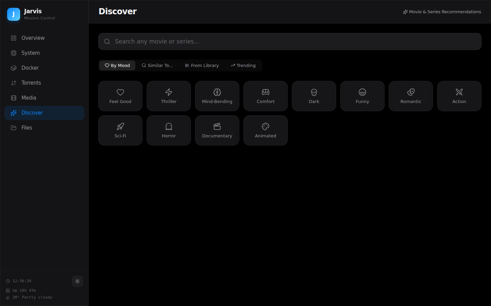


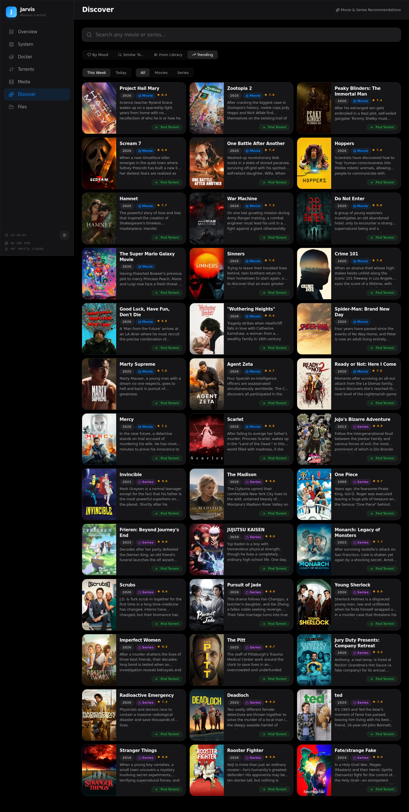

**Detail Pages** — Full TMDB metadata with poster, backdrop, synopsis, cast, ratings, and related titles. Breadcrumb navigation throughout.

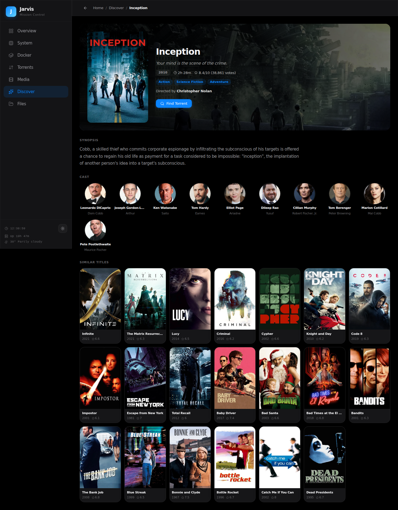

**Torrent Integration** — Every recommendation includes a "Find Torrent" button that searches available sources and adds directly to qBittorrent.

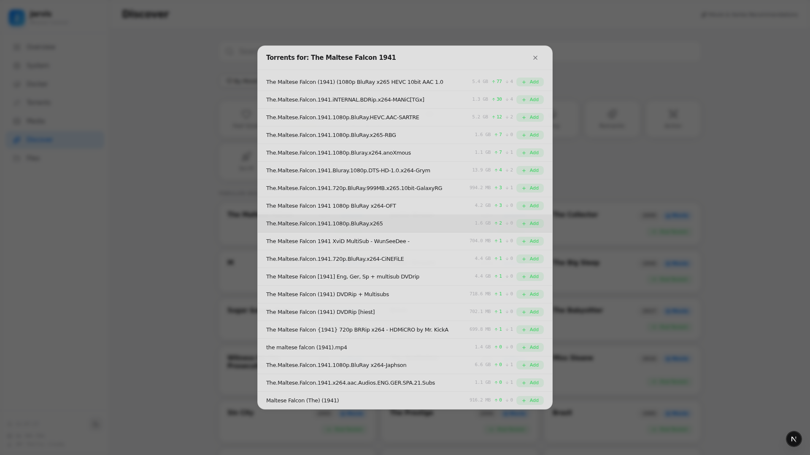

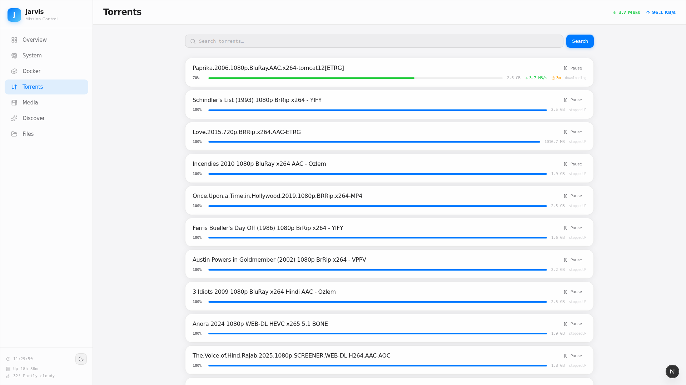

### Infrastructure Monitoring

Real-time CPU, RAM, and disk usage. 30-minute bandwidth history. Top processes by resource consumption. Storage breakdown by directory.

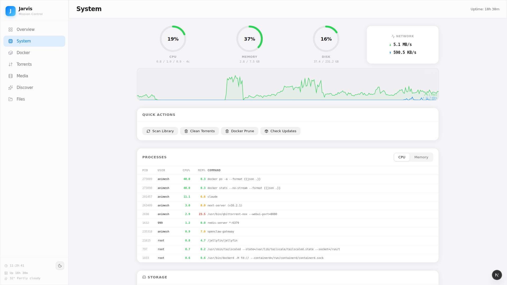

### Docker Management

Container overview with status indicators and resource bars. Start, stop, restart any container. Live log viewer.

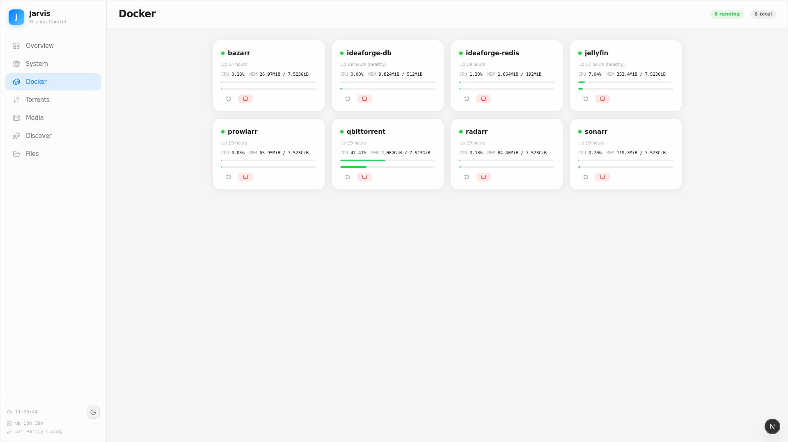

### Jellyfin Media Library

Library statistics, recently added items, and active streaming sessions.

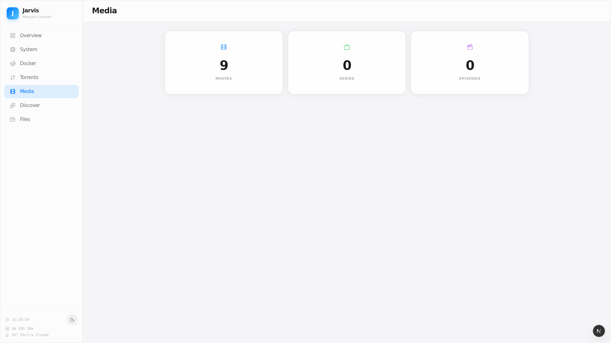

### File Explorer

Filesystem browser with breadcrumb navigation. Supports rename, copy, move, delete, and download operations.

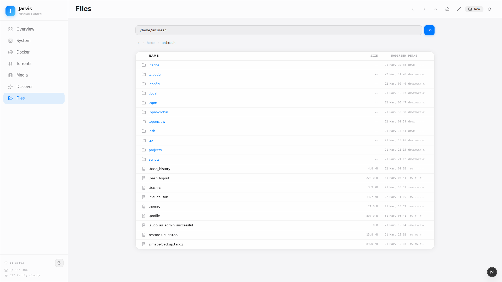

### Theming

Dark and light modes with system preference detection.

| Dark | Light |
|------|-------|
|  | 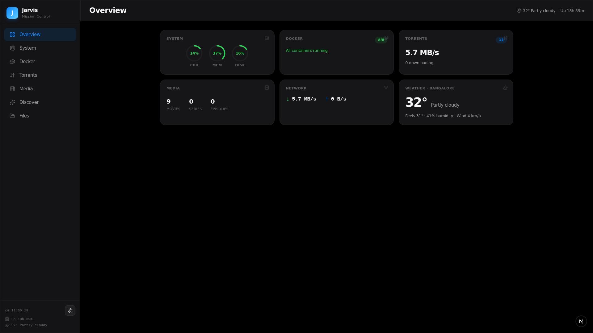 |

---

## Architecture

```
Browser ──→ Next.js (3000) ──→ Python Backend (8002) ──┬──→ Docker CLI
                                                        ├──→ Jellyfin API (8096)
                                                        ├──→ qBittorrent API (8080)
                                                        ├──→ TMDB API
                                                        ├──→ Reddit Wiki
                                                        └──→ System (/proc, du, etc.)
```

| Layer | Stack |
|-------|-------|
| Frontend | Next.js 16, React 19, TypeScript, SCSS Modules |
| Backend | Python 3 stdlib — single `server.py`, zero external dependencies |
| Icons | Lucide React |
| Theme | CSS custom properties, localStorage |
| Data Sources | TMDB, Jellyfin, qBittorrent, Docker, Reddit Wiki, wttr.in |

The backend is a single Python file (~1,600 lines) using `ThreadingHTTPServer` from the standard library. No framework dependencies. It handles API proxying, system metrics, wiki parsing, and TMDB response caching.

---

## Getting Started

```bash
git clone https://github.com/Animesh98/jarvis-dashboard.git
cd jarvis-dashboard

cp .env.example .env
# Set your keys in .env:
#   JELLYFIN_API_KEY=...
#   QBIT_USER=...
#   QBIT_PASS=...
#   TMDB_API_KEY=...    (free at themoviedb.org)

# Backend
python3 server.py &

# Frontend
cd frontend && npm install && npm run dev
```

Open `http://localhost:3000`.

**Requirements:** Python 3.8+, Node.js 18+, Docker, Jellyfin, and qBittorrent accessible on the local network.

---

<details>
<summary><strong>API Reference (30+ endpoints)</strong></summary>

### System

| Method | Endpoint | Description |
|--------|----------|-------------|
| GET | `/api/system` | CPU, memory, disk, uptime |
| GET | `/api/processes` | Top processes by CPU and memory |
| GET | `/api/storage` | Media directory sizes (cached 5 min) |
| GET | `/api/weather` | Weather data (cached 15 min) |
| GET | `/api/bandwidth/history` | Network throughput history (30 min) |

### Docker

| Method | Endpoint | Description |
|--------|----------|-------------|
| GET | `/api/docker/containers` | List containers with status |
| GET | `/api/docker/stats` | Container resource usage |
| GET | `/api/docker/logs?container=X&lines=N` | Container log output |
| POST | `/api/docker/action` | Start, stop, or restart a container |

### Torrents

| Method | Endpoint | Description |
|--------|----------|-------------|
| GET | `/api/torrent-search?q=X` | Search available torrents |
| POST | `/api/torrent-add` | Add magnet link to qBittorrent |
| GET/POST | `/api/qbit/*` | Proxy to qBittorrent Web API |

### Media

| Method | Endpoint | Description |
|--------|----------|-------------|
| GET | `/api/jellyfin/*` | Proxy to Jellyfin API |

### Recommendations

| Method | Endpoint | Description |
|--------|----------|-------------|
| GET | `/api/recommendations/mood?mood=X` | Mood-based recommendations |
| GET | `/api/recommendations/similar?title=X` | Similar titles via TMDB |
| GET | `/api/recommendations/library` | Personalized suggestions from library analysis |
| GET | `/api/recommendations/trending?time_window=week` | TMDB trending (day or week) |
| GET | `/api/recommendations/categories` | Available recommendation categories |
| GET | `/api/recommendations/autocomplete?q=X` | Title autocomplete |
| GET | `/api/recommendations/search?q=X` | TMDB multi-search |
| GET | `/api/recommendations/detail?tmdb_id=X&type=Y` | Full movie/series detail |

### Files

| Method | Endpoint | Description |
|--------|----------|-------------|
| GET | `/api/files/list?path=X` | Directory listing |
| GET | `/api/files/download?path=X` | File download |
| POST | `/api/files/delete` | Delete file or directory |
| POST | `/api/files/move` | Move file or directory |
| POST | `/api/files/copy` | Copy file or directory |
| POST | `/api/files/mkdir` | Create directory |
| POST | `/api/files/rename` | Rename file or directory |

### Quick Actions

| Method | Endpoint | Description |
|--------|----------|-------------|
| POST | `/api/actions/jellyfin-scan` | Trigger Jellyfin library scan |
| POST | `/api/actions/clean-torrents` | Remove completed torrents |
| POST | `/api/actions/docker-prune` | Prune unused Docker resources |
| POST | `/api/actions/update-check` | Check for system updates |

</details>

---

## Acknowledgements

- [TMDB](https://www.themoviedb.org/) — Movie and series metadata
- [r/MovieSuggestions](https://www.reddit.com/r/MovieSuggestions/) — Community-curated recommendation data
- [Lucide](https://lucide.dev/) — Icon set
- [wttr.in](https://wttr.in/) — Weather data
- Built with [Claude Code](https://claude.com/claude-code)

## License

MIT
