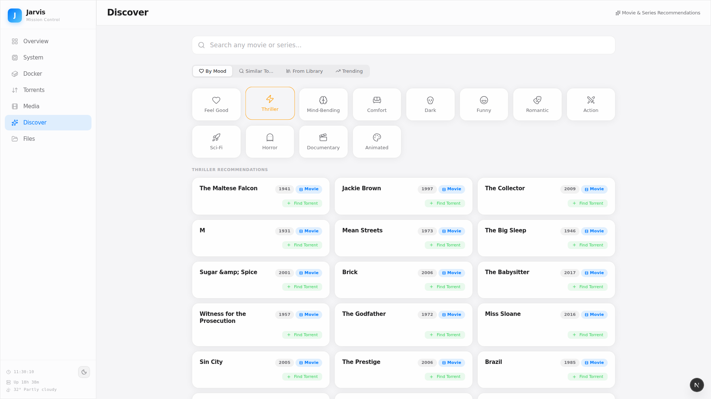
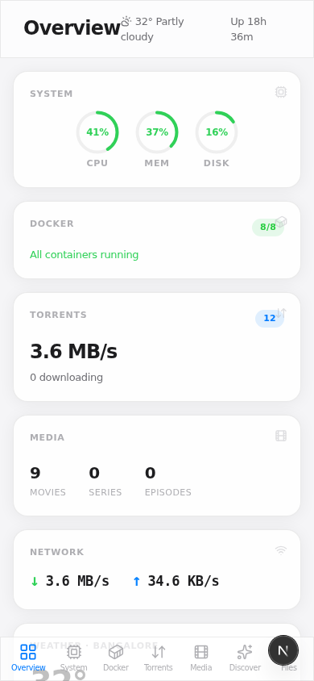

# Jarvis Dashboard -- Homelab Mission Control

**A single-pane-of-glass dashboard for managing your entire homelab: system monitoring, Docker, torrents, media, file management, and an AI-powered movie recommendation engine.**


## What is this?

Jarvis is a self-hosted homelab dashboard that replaces the need to SSH into your server or juggle a dozen browser tabs. It brings together real-time system stats, Docker container management, torrent operations, Jellyfin media tracking, a full file explorer, and a movie recommendation engine powered by Reddit community data and TMDB -- all wrapped in a clean, responsive interface with dark and light modes.

## Features

| Feature | Description |
|---------|-------------|
| **System Monitoring** | Real-time CPU, RAM, disk gauges with bandwidth history graph and top processes |
| **Docker Management** | Container grid with status indicators, CPU/memory bars, start/stop/restart, live log viewer |
| **Torrent Integration** | Search, add, and manage torrents via qBittorrent with progress tracking |
| **Jellyfin Media** | Library stats, recently added, now playing sessions |
| **Movie Recommendations** | Mood-based, similar-to, library analysis, and trending -- powered by Reddit + TMDB |
| **TMDB Movie Search** | Search any movie or series with full detail pages (cast, ratings, posters, synopsis) |
| **File Explorer** | Browse, rename, copy, move, delete, download -- with breadcrumbs and context menus |
| **Dark / Light Mode** | System-aware theme toggle with CSS variables |
| **Responsive UI** | Desktop sidebar + mobile bottom navigation |

## Screenshots

### Overview Dashboard


### System Monitoring


### Docker Management


### Movie Discovery -- Mood Picker


### Movie Discovery -- Results


### Movie Detail Page


### Torrent Management


### File Explorer


### Mobile View


## Architecture

```
Browser --> Next.js (3000) --> Python Backend (8002) --> Docker / Jellyfin / qBittorrent / TMDB / Reddit
```

| Layer | Tech |
|-------|------|
| Frontend | Next.js 16, React 19, TypeScript, SCSS Modules |
| Backend | Python 3 (stdlib only -- no Flask/Django/pip installs) |
| Icons | Lucide React |
| Theme | CSS Variables + localStorage |
| Data Sources | Jellyfin API, qBittorrent API, Docker CLI, TMDB API, Reddit Wiki, wttr.in |

The backend is a single `server.py` file using Python's built-in `ThreadingHTTPServer`. It acts as an API proxy (avoiding CORS issues), runs system/Docker commands via subprocess, and serves as the bridge between the Next.js frontend and all external services. Zero dependencies beyond the Python standard library.

## Recommendation Engine

This is the standout feature. The movie recommendation system combines curated community data with live API enrichment:

**Data source:** Reddit [r/MovieSuggestions](https://www.reddit.com/r/MovieSuggestions/) wiki -- 2,896 curated movies across 120 categories, scraped and indexed locally.

**Four discovery modes:**

| Mode | How it works |
|------|-------------|
| **By Mood** | Pick from 12 moods (Feel Good, Thriller, Mind-Bending, Horror, etc.) to get curated picks |
| **Similar To** | Type a movie name with autocomplete, get community-recommended similar titles |
| **From Library** | Analyzes your Jellyfin library genres to suggest titles you don't already own |
| **Trending** | Current trending movies and series from TMDB |

Every recommendation links to a full detail page with TMDB data (cast, ratings, poster, synopsis), and a one-click "Find Torrent" button that searches and adds torrents directly from the recommendation card.

## Setup

```bash
# 1. Clone the repo
git clone https://github.com/your-username/jarvis-dashboard.git
cd jarvis-dashboard

# 2. Configure environment
cp .env.example .env
# Edit .env with your credentials:
#   JELLYFIN_API_KEY=your_key
#   QBIT_USER=admin
#   QBIT_PASS=your_password
#   TMDB_API_KEY=your_tmdb_key

# 3. Start the backend
python3 server.py &

# 4. Start the frontend
cd frontend
npm install
npm run dev

# 5. Open http://localhost:3000
```

**Requirements:** Python 3.8+, Node.js 18+, Docker (for container management features), Jellyfin and qBittorrent running on the same network.

<details>
<summary><strong>API Endpoints</strong></summary>

### System

| Method | Endpoint | Description |
|--------|----------|-------------|
| GET | `/api/system` | CPU, memory, disk, uptime |
| GET | `/api/processes` | Top 10 processes by CPU and memory |
| GET | `/api/storage` | Media directory sizes (cached 5min) |
| GET | `/api/weather` | Weather via wttr.in (cached 15min) |
| GET | `/api/bandwidth/history` | Network speed history (last 30min) |

### Docker

| Method | Endpoint | Description |
|--------|----------|-------------|
| GET | `/api/docker/containers` | List all containers with status |
| GET | `/api/docker/stats` | Container resource usage |
| GET | `/api/docker/logs?container=X&lines=N` | Container log output |
| POST | `/api/docker/action` | Start, stop, or restart a container |

### Torrents

| Method | Endpoint | Description |
|--------|----------|-------------|
| GET | `/api/torrent-search?q=X` | Search torrents via apibay |
| POST | `/api/torrent-add` | Add magnet link to qBittorrent |
| GET/POST | `/api/qbit/*` | Proxy to qBittorrent Web API |

### Media

| Method | Endpoint | Description |
|--------|----------|-------------|
| GET | `/api/jellyfin/*` | Proxy to Jellyfin API (items, sessions, system info) |

### Recommendations

| Method | Endpoint | Description |
|--------|----------|-------------|
| GET | `/api/recommendations/mood?mood=X` | Get recommendations by mood |
| GET | `/api/recommendations/similar?title=X` | Find similar titles |
| GET | `/api/recommendations/library` | Recommendations based on Jellyfin library |
| GET | `/api/recommendations/trending` | Currently trending on TMDB |
| GET | `/api/recommendations/categories` | List all available categories |
| GET | `/api/recommendations/autocomplete?q=X` | Title autocomplete for search |
| GET | `/api/recommendations/search?q=X` | Full TMDB search |
| GET | `/api/recommendations/detail?type=X&id=Y` | Full movie/series detail from TMDB |

### Files

| Method | Endpoint | Description |
|--------|----------|-------------|
| GET | `/api/files/list?path=X` | List directory contents |
| GET | `/api/files/download?path=X` | Download a file |
| POST | `/api/files/delete` | Delete file or directory |
| POST | `/api/files/move` | Move file or directory |
| POST | `/api/files/copy` | Copy file or directory |
| POST | `/api/files/mkdir` | Create new directory |
| POST | `/api/files/rename` | Rename file or directory |

### Quick Actions

| Method | Endpoint | Description |
|--------|----------|-------------|
| POST | `/api/actions/jellyfin-scan` | Trigger Jellyfin library scan |
| POST | `/api/actions/clean-torrents` | Remove completed torrents |
| POST | `/api/actions/docker-prune` | Prune unused Docker resources |
| POST | `/api/actions/update-check` | Check for system updates |

</details>

## Credits

- Built with [Claude Code](https://claude.com/claude-code) -- AI pair programming
- Movie data: [TMDB](https://www.themoviedb.org/), Reddit [r/MovieSuggestions](https://www.reddit.com/r/MovieSuggestions/) community
- Icons: [Lucide](https://lucide.dev/)
- Weather: [wttr.in](https://wttr.in/)

## License

MIT
