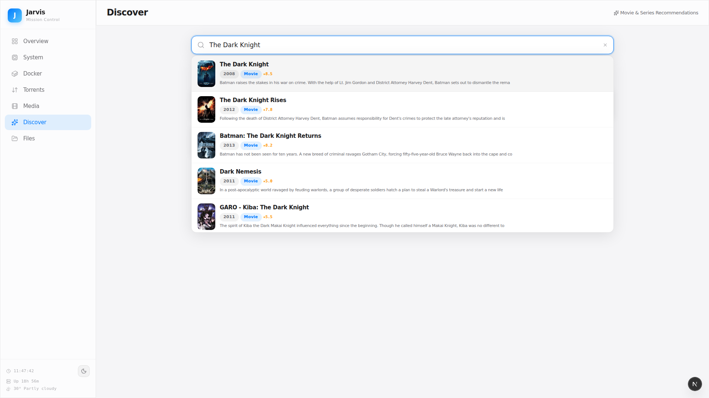

# Jarvis Dashboard — Homelab Mission Control

**One dashboard to monitor your server, manage Docker containers, discover movies, and download them — all without leaving the browser.**


---

## The Killer Feature: Discover → Watch

Most homelab dashboards stop at system monitoring. Jarvis goes further — it has a built-in **movie recommendation engine** that connects directly to your torrent client. The entire workflow lives inside the dashboard:

### 1. Pick a mood or search for anything

Choose from 12 moods, search by title, analyze your library, or browse what's trending.




### 2. Get smart recommendations

Recommendations are powered by **2,896 curated movies** from Reddit's r/MovieSuggestions wiki (120 categories) + TMDB's recommendation engine. Type a movie name and get autocomplete suggestions from the knowledge base.


### 3. Explore full movie details

Click any recommendation to see the full TMDB detail page — poster, backdrop, synopsis, cast with photos, ratings, and similar titles.


### 4. One click to download

Hit "Find Torrent" on any recommendation or detail page. The dashboard searches for available torrents and lets you add them directly to qBittorrent — no switching apps, no copy-pasting magnet links.


### 5. Track your downloads

Switch to the Torrents tab to monitor progress, pause/resume, and manage all your downloads.


---

## Everything Else

Jarvis isn't just a movie finder. It's a complete homelab control panel.

### System Monitoring
Real-time CPU, RAM, and disk gauges. 30-minute bandwidth history chart. Top processes by CPU/memory. Storage breakdown by directory.


### Docker Management
See all containers at a glance with status indicators, CPU/memory bars. Start, stop, restart any container. View live logs.


### Jellyfin Media Library
Library stats (movies, series, episodes), recently added items, and active streaming sessions.


### File Explorer
Full filesystem browser with breadcrumb navigation, rename, copy, move, delete, and download.


### Dark & Light Mode
Toggle between themes. Preference is saved and respects your system setting.

| Dark Mode | Light Mode |
|-----------|------------|
|  |  |

---

## Recommendation Engine — How It Works

| Mode | What it does |
|------|-------------|
| **By Mood** | Pick from 12 moods (Feel Good, Thriller, Mind-Bending, Horror, etc.) — returns curated picks from Reddit's community wiki |
| **Similar To** | Type a movie name with autocomplete, get similar titles from TMDB + Reddit community data |
| **From Library** | Analyzes your Jellyfin library genres and recommends titles you don't already own |
| **Trending** | Reddit's community-voted monthly top 100 movies |


**Data sources:**
- **Reddit r/MovieSuggestions wiki** — 2,896 movies across 120 hand-curated categories, parsed and indexed locally. Categories like *Action > Hidden Badass*, *Thriller > Mindfuck*, *Comedy > Mockumentary*, *Drama > Coming of Age*.
- **TMDB API** — Movie details, cast, posters, ratings, and recommendation engine.
- **Knowledge base is cached for 24 hours** — no rate limiting issues, instant responses.

Every recommendation card has a **"Find Torrent"** button. Click it, pick a torrent from the search results, and it's added to qBittorrent. The movie shows up in Jellyfin once downloaded and imported. **Discover → Download → Watch — all from one interface.**

---

## Architecture

```
Browser ──→ Next.js (3000) ──→ Python Backend (8002) ──┬──→ Docker CLI
                                                        ├──→ Jellyfin API (8096)
                                                        ├──→ qBittorrent API (8080)
                                                        ├──→ TMDB API
                                                        ├──→ Reddit Wiki
                                                        └──→ System (/proc, du, etc.)
```

| Layer | Tech |
|-------|------|
| Frontend | Next.js 16, React 19, TypeScript, SCSS Modules |
| Backend | Python 3 stdlib — single `server.py`, zero pip dependencies |
| Icons | Lucide React |
| Theme | CSS variables + localStorage |
| Data | Jellyfin, qBittorrent, Docker, TMDB, Reddit Wiki, wttr.in |

The backend is a **single Python file** using the standard library's `ThreadingHTTPServer`. No Flask, no Django, no `pip install`. It proxies API calls (avoiding CORS), runs system commands via subprocess, scrapes Reddit wikis, and caches TMDB responses. ~1,600 lines of code.

---

## Quick Start

```bash
# Clone
git clone https://github.com/Animesh98/jarvis-dashboard.git
cd jarvis-dashboard

# Configure
cp .env.example .env
# Edit .env:
#   JELLYFIN_API_KEY=your_key
#   QBIT_USER=admin
#   QBIT_PASS=your_password
#   TMDB_API_KEY=your_tmdb_key  (free at themoviedb.org)

# Start backend
python3 server.py &

# Start frontend
cd frontend && npm install && npm run dev

# Open http://localhost:3000
```

**Requirements:** Python 3.8+, Node.js 18+, Docker, Jellyfin, qBittorrent on the same network.

---

<details>
<summary><strong>Full API Reference (30+ endpoints)</strong></summary>

### System

| Method | Endpoint | Description |
|--------|----------|-------------|
| GET | `/api/system` | CPU, memory, disk, uptime |
| GET | `/api/processes` | Top 10 processes by CPU and memory |
| GET | `/api/storage` | Media directory sizes (cached 5min) |
| GET | `/api/weather` | Weather via wttr.in (cached 15min) |
| GET | `/api/bandwidth/history` | Network speed history (last 30min) |

### Docker

| Method | Endpoint | Description |
|--------|----------|-------------|
| GET | `/api/docker/containers` | List all containers with status |
| GET | `/api/docker/stats` | Container resource usage |
| GET | `/api/docker/logs?container=X&lines=N` | Container log output |
| POST | `/api/docker/action` | Start, stop, or restart a container |

### Torrents

| Method | Endpoint | Description |
|--------|----------|-------------|
| GET | `/api/torrent-search?q=X` | Search torrents via apibay |
| POST | `/api/torrent-add` | Add magnet link to qBittorrent |
| GET/POST | `/api/qbit/*` | Proxy to qBittorrent Web API |

### Media

| Method | Endpoint | Description |
|--------|----------|-------------|
| GET | `/api/jellyfin/*` | Proxy to Jellyfin API |

### Recommendations

| Method | Endpoint | Description |
|--------|----------|-------------|
| GET | `/api/recommendations/mood?mood=X` | Recommendations by mood |
| GET | `/api/recommendations/similar?title=X` | Find similar titles |
| GET | `/api/recommendations/library` | Recommendations from Jellyfin library analysis |
| GET | `/api/recommendations/trending` | Monthly top 100 from Reddit |
| GET | `/api/recommendations/categories` | List all 120 wiki categories |
| GET | `/api/recommendations/autocomplete?q=X` | Title autocomplete |
| GET | `/api/recommendations/search?q=X` | Full TMDB multi-search |
| GET | `/api/recommendations/detail?tmdb_id=X&type=Y` | Full movie/series detail |

### Files

| Method | Endpoint | Description |
|--------|----------|-------------|
| GET | `/api/files/list?path=X` | List directory contents |
| GET | `/api/files/download?path=X` | Download a file |
| POST | `/api/files/delete` | Delete file or directory |
| POST | `/api/files/move` | Move file or directory |
| POST | `/api/files/copy` | Copy file or directory |
| POST | `/api/files/mkdir` | Create directory |
| POST | `/api/files/rename` | Rename file or directory |

### Quick Actions

| Method | Endpoint | Description |
|--------|----------|-------------|
| POST | `/api/actions/jellyfin-scan` | Trigger Jellyfin library scan |
| POST | `/api/actions/clean-torrents` | Remove completed torrents |
| POST | `/api/actions/docker-prune` | Prune unused Docker resources |
| POST | `/api/actions/update-check` | Check for system updates |

</details>

---

## Credits

- Built with [Claude Code](https://claude.com/claude-code) — AI pair programming
- Movie data: [TMDB](https://www.themoviedb.org/), Reddit [r/MovieSuggestions](https://www.reddit.com/r/MovieSuggestions/) community
- Icons: [Lucide](https://lucide.dev/)
- Weather: [wttr.in](https://wttr.in/)

## License

MIT
