# Jarvis Dashboard — Architecture

A self-hosted homelab dashboard combining infrastructure monitoring, container management, media discovery, and automated torrent downloads.

---

## System Overview

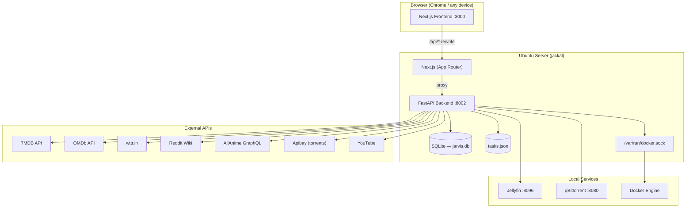

---

## Request Flow

Every user request follows the same path: browser to Next.js, proxied to FastAPI, routed to the right service.

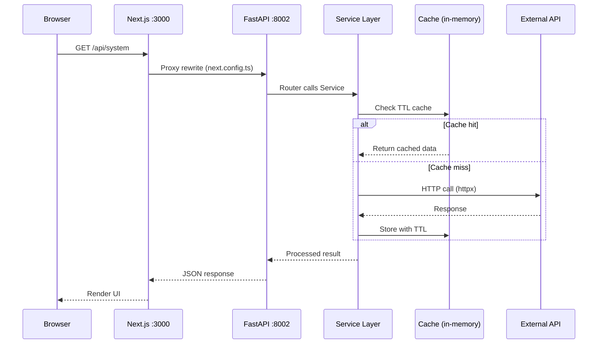

---

## Frontend Architecture

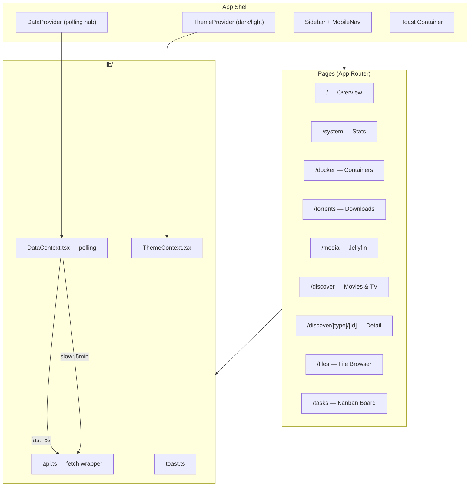

### Polling Cycles

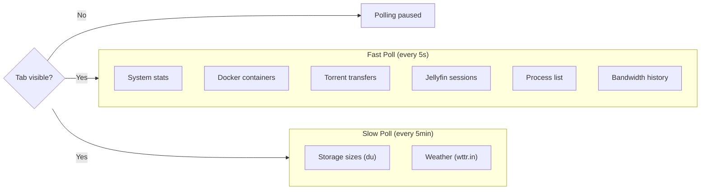

- Uses `Promise.allSettled()` so one failed endpoint doesn't break the dashboard
- Tab visibility API pauses polling when the browser tab is hidden

---

## Backend Architecture

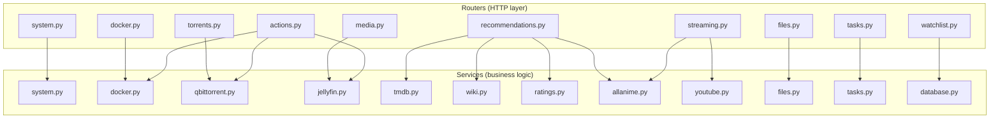

### Router to External Service Mapping

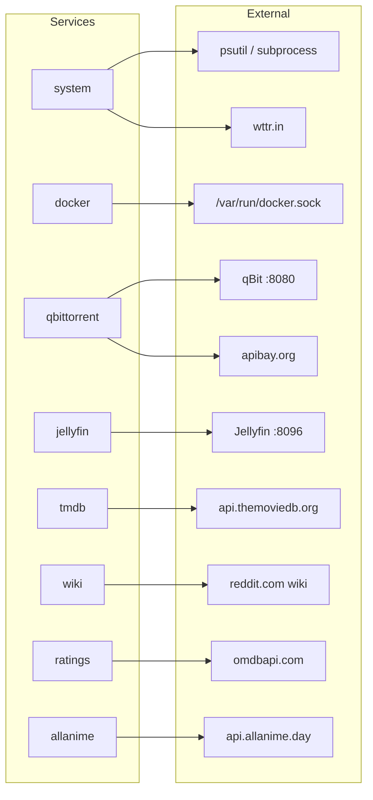

---

## Data Storage

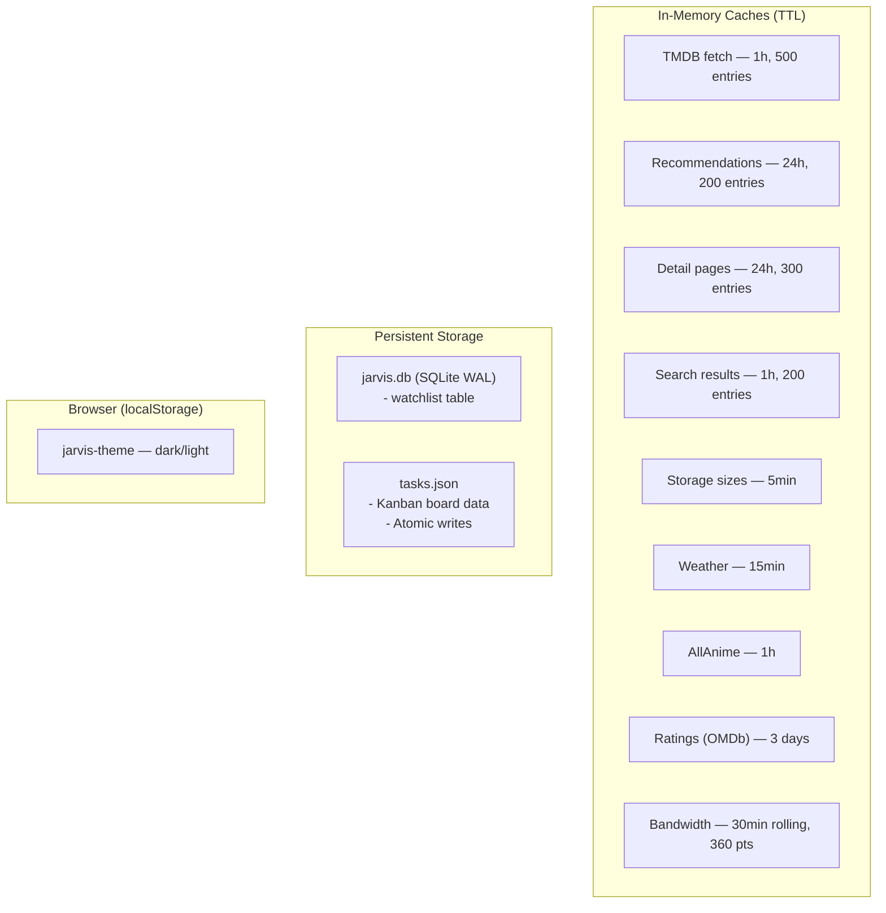

---

## Media Discovery Flow

The most complex subsystem — aggregates multiple sources for movie/TV recommendations.

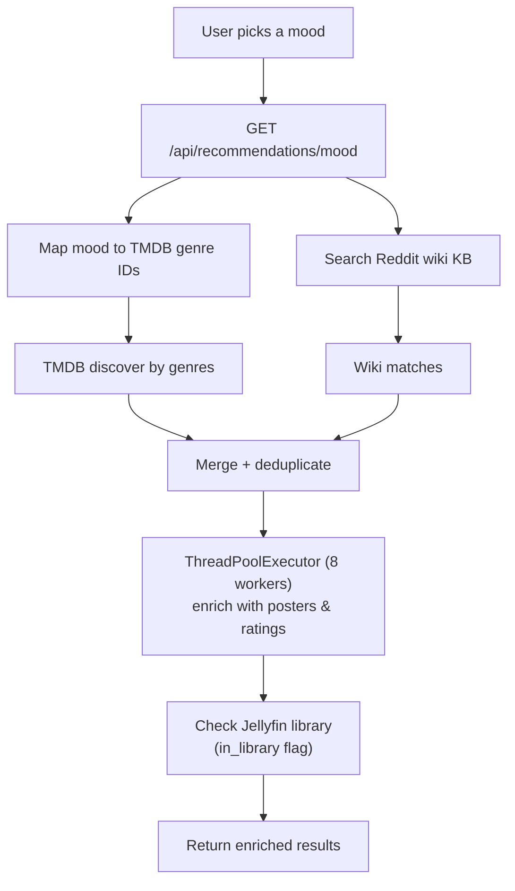

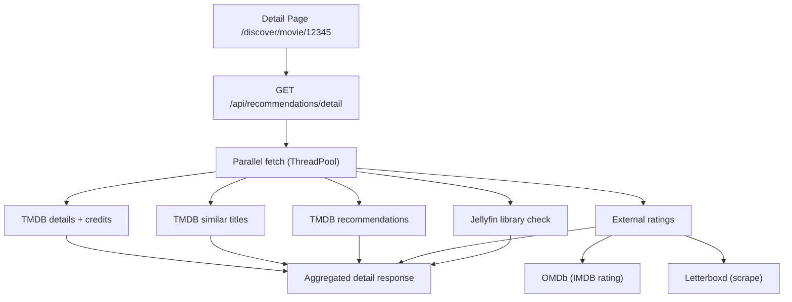

---

## Image Proxying

TMDB and Jellyfin images are proxied through the backend so Tailscale clients can resolve them.

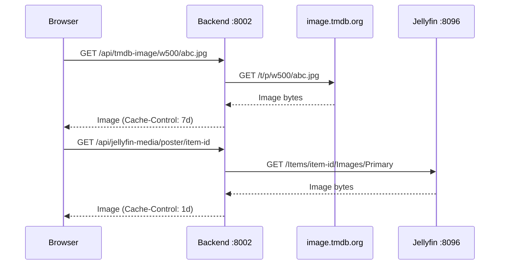

---

## Torrent Workflow

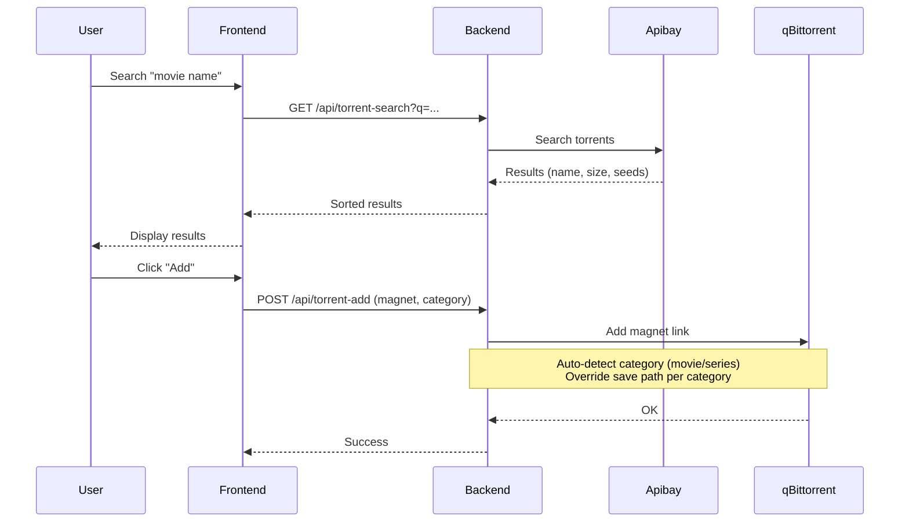

---

## Task Kanban Flow

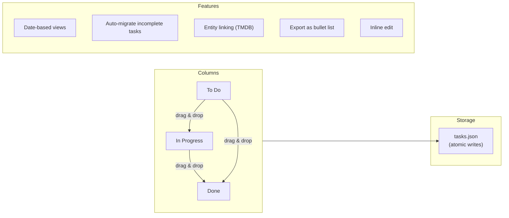

---

## Deployment Topology

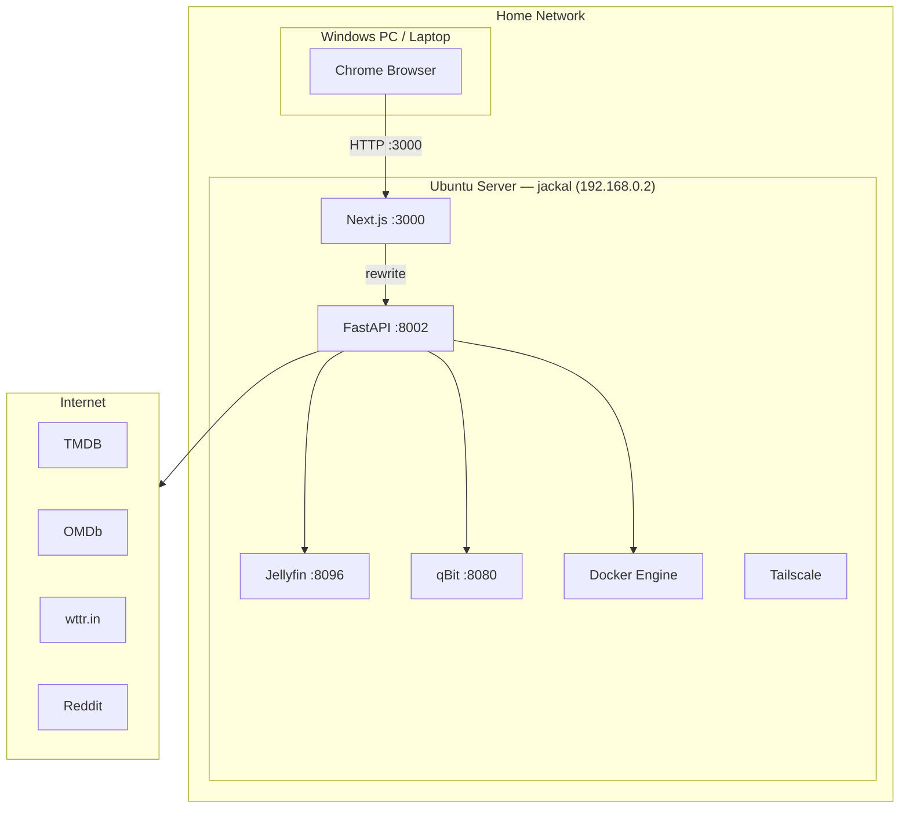

---

## Tech Stack Summary

| Layer | Technology |
|-------|-----------|
| Frontend | Next.js 16, React 19, TypeScript, SCSS Modules |
| Backend | FastAPI, Python 3.12, Pydantic, httpx |
| Database | SQLite (WAL mode) for watchlist |
| File storage | JSON (tasks), in-memory TTL caches |
| Icons | Lucide React |
| Media | Jellyfin, TMDB, OMDb, Reddit Wiki |
| Torrents | qBittorrent, Apibay |
| Containers | Docker (CLI via socket) |
| Weather | wttr.in |
| Networking | Tailscale (remote access) |

---

## Key Design Decisions

- **No database for most data** — system stats, docker, torrents are all real-time. Only watchlist (SQLite) and tasks (JSON) need persistence.
- **In-memory TTL caching** — avoids redundant external API calls. Each service manages its own cache.
- **Image proxying** — required for Tailscale clients that can't resolve CDN domains directly.
- **Promise.allSettled()** — frontend resilience. One broken API doesn't crash the dashboard.
- **ThreadPoolExecutor** — parallel TMDB enrichment (posters, ratings) keeps discovery pages fast.
- **Atomic file writes** — tasks.json uses tempfile + rename to prevent corruption.
- **No auth** — homelab-only, not exposed to the internet.
